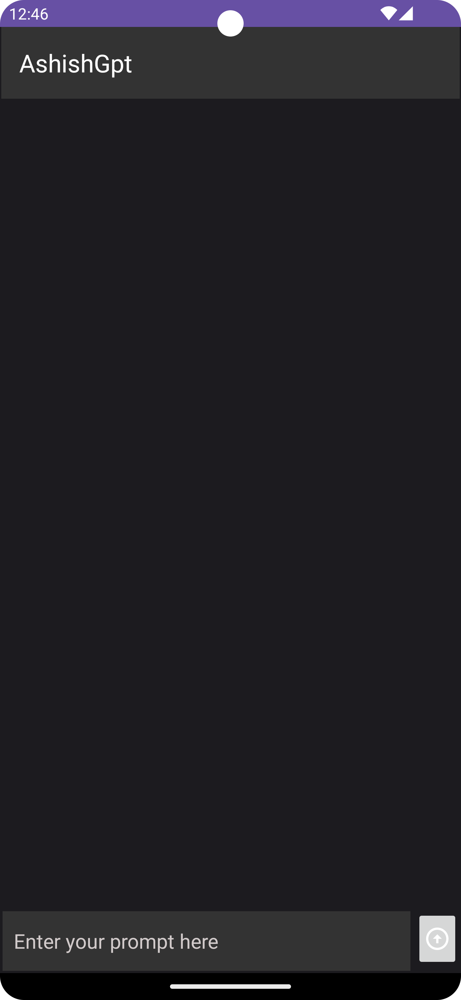
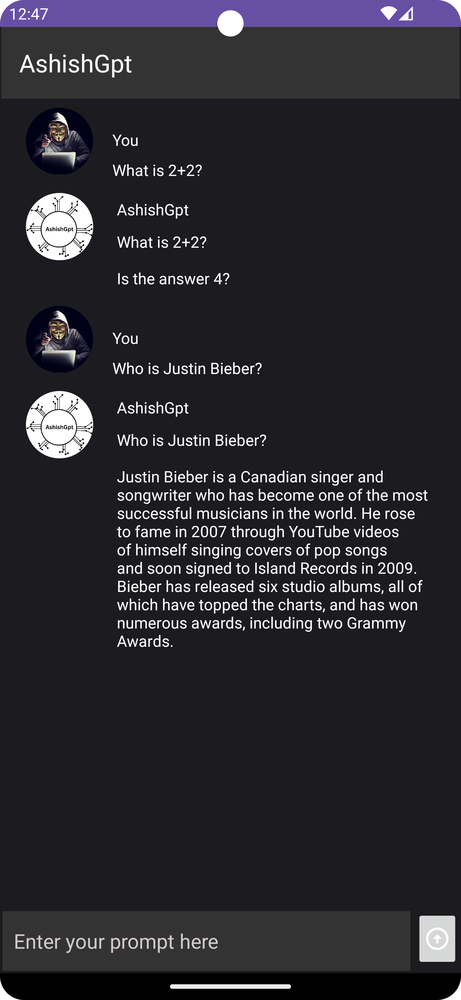

# AshishGpt

The project is developed to work like all the GPTs we love and use. This one is called AshishGpt.

 # Android Concepts Used

<h4>Hilt Dependency Injection</h4>
<h4>MVVM architecture</h4>
<h4>Gson Converter</h4>
<h4>ViewModel</h4>
<h4>Retrofit</h4>
 

